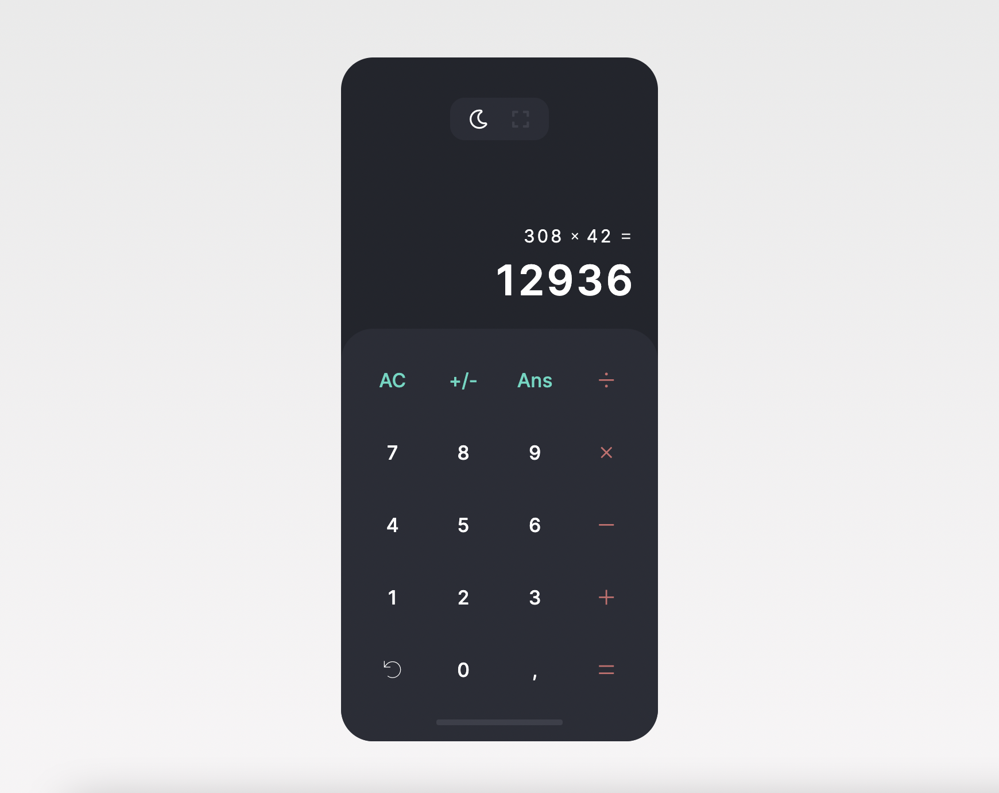

# React Calculator App

A beautifully designed calculator pwa with light, dark mode and full-screen support.




Original Design by [Lucia Scott](https://dribbble.com/luciascott) <br>
All further design by me

## Live version

[click here](https://marvinscheffold.github.io/react-calculator/)

## Development

```
npm start
```

## Deployment

```
npm run deploy
```

## Todo 

- Prevent division by 0 
- Make app independent from outside icons or fonts by adding them to cache for pwa or prodiving fallback
- Replace eval calculation by concatenating functions 
- Refractor renaming "keys" to "input" or something similar (funtionality has outgrown the name far too much)


